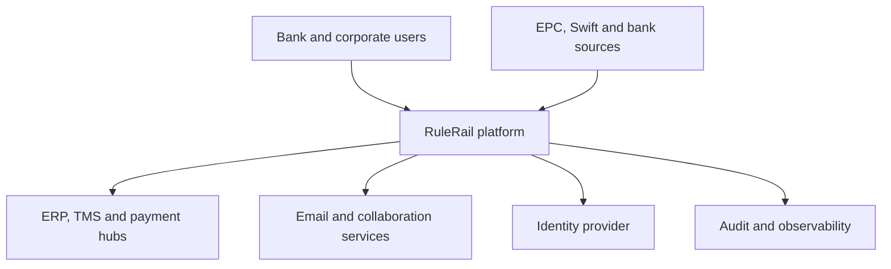
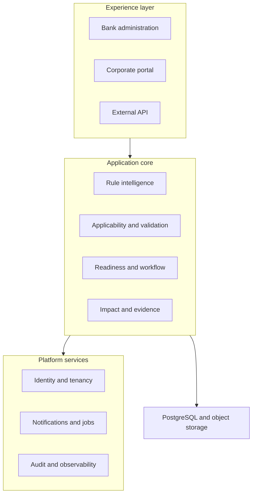
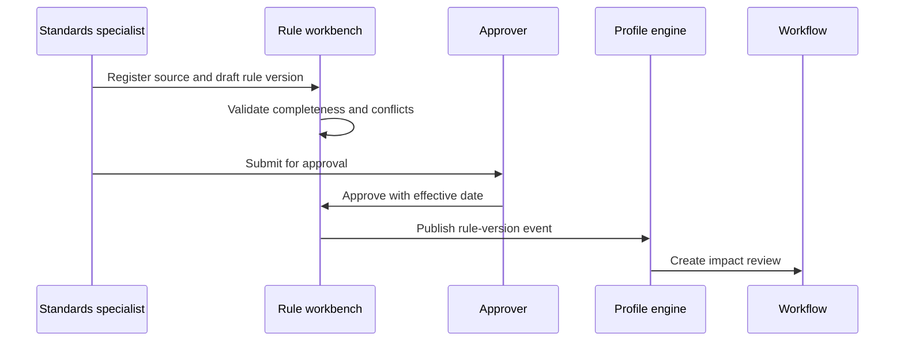
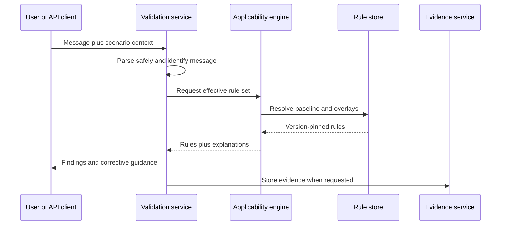
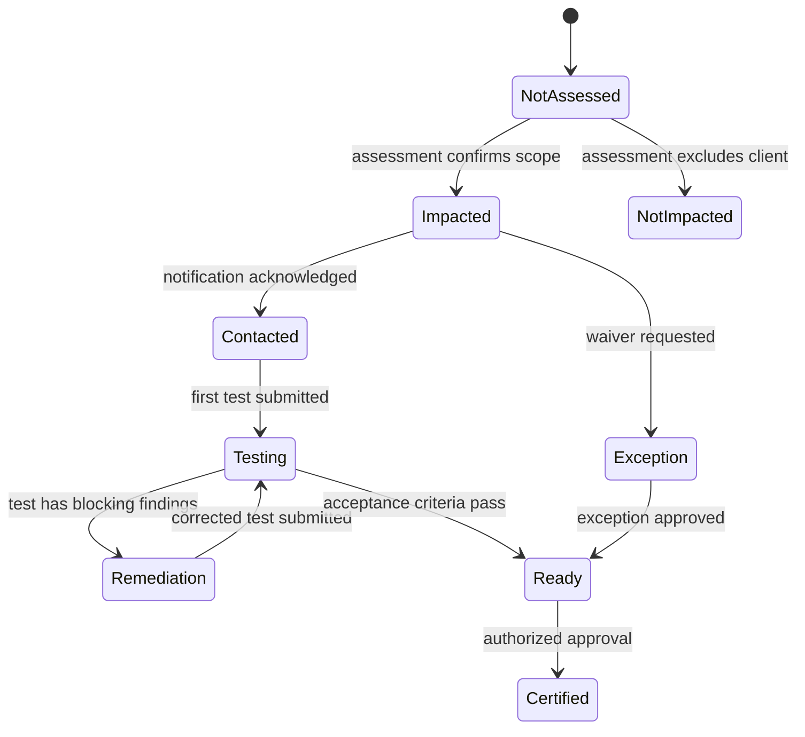
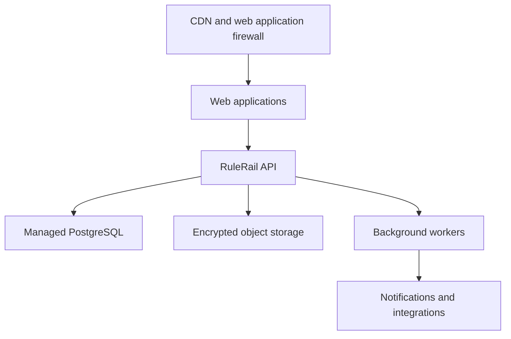

# RuleRail High-Level Design

**Product:** RuleRail — Payment Standards Intelligence & Client Readiness Platform  
**Document version:** 1.0  
**Status:** Target architecture with public-MVP deployment profile  
**Baseline date:** 3 September 2026

## 1. Purpose

This document defines the target architecture for RuleRail and the deliberately smaller architecture used by the public demo. It translates the business requirements into bounded components, integration contracts, data domains, security controls and deployment decisions.

RuleRail is a decision-support and readiness platform. It interprets approved payment requirements, determines applicability, validates supplied messages and coordinates migration evidence. It does not initiate, route or settle payments.

## 2. Architecture principles

1. **Source before assertion.** Every active rule is traceable to an authoritative source and an approved interpretation.
2. **Deterministic execution.** Identical input, rule-set version and execution date produce the same validation result.
3. **Effective-dated truth.** Rules, profiles and decisions are versioned; historical outcomes remain reproducible.
4. **Layered requirements.** Scheme/network baselines are preserved separately from bank, channel and client overlays.
5. **Human-governed intelligence.** Automation or AI may propose changes, but an authorized specialist approves them.
6. **Tenant isolation by design.** Bank-specific content and client data never leak across tenants.
7. **Explainability is a feature.** Applicability and validation results expose their reasoning and sources.
8. **Modular first.** Start as a well-bounded modular monolith; extract services only where scale or ownership justifies it.
9. **No payment execution.** The system is outside the payment authorization and settlement path.
10. **Secure minimization.** Avoid payment data where reference or synthetic data can meet the purpose.

## 3. System context

### 3.1 Actors and external systems

| Actor/system | Interaction |
|---|---|
| Standards specialist | Registers sources, models rules and approves versions |
| Payment product owner | Reviews impact and publishes bank profiles |
| Client manager | Segments clients, assigns actions and tracks readiness |
| Corporate treasury user | Compares bank rules, validates files and supplies evidence |
| Corporate technical user | Consumes profiles/API contracts and resolves findings |
| Risk/audit user | Reviews traceability, exceptions and historical evidence |
| EPC/Swift/banks | Publish source documents and change notices |
| ERP/TMS/payment hub | Sends messages for validation and consumes rule profiles |
| Identity provider | Authenticates users and supplies tenant/role claims |
| Notification provider | Delivers targeted change and task notifications |

## 4. Logical architecture

### 4.1 Experience layer

- **Bank administration application:** source registry, rule workbench, bank-profile studio, impact analysis, client portfolio and governance dashboards.
- **Corporate portal:** white-labelled tenant experience for guidance, multibank comparison, validation, assigned actions, evidence and certification.
- **External API:** versioned REST endpoints for rules, profiles, validation, readiness and webhooks. File submissions use controlled object upload for large payloads.

### 4.2 Application modules

| Module | Responsibilities | Owns |
|---|---|---|
| Source registry | Source metadata, versions, provenance and status | Source, source version, source reference |
| Rule intelligence | Normalized requirements, versions, overlays and approvals | Rule family, rule version, decision table |
| Applicability engine | Selects effective rules for a scenario | Applicability decision and explanation |
| Profile studio | Scheme baseline and bank/channel overlay composition | Profile, profile version, release |
| Validation service | Parses supported messages and evaluates selected rules | Validation job, finding, result summary |
| Change impact | Diffs rule versions and maps affected assets | Change set, impact item, review decision |
| Client readiness | Segmentation, journeys, tasks, tests and certification | Client programme, task, milestone, readiness |
| Evidence and audit | Immutable business evidence and audit trail | Evidence item, audit event, export |
| Notification service | Templated, targeted and retryable communications | Notification request and delivery state |
| Reporting | Operational and management metrics | Read models and export definitions |

## 5. Recommended implementation topology

The target release should use a **modular monolith** for transactional consistency and delivery speed, plus independently scalable background workers for document processing, bulk validation and notifications.

| Concern | Recommended technology |
|---|---|
| Web applications | React/Next.js with a shared design system |
| Application/API | .NET 9 ASP.NET Core modular monolith |
| Background processing | .NET workers with durable job records |
| Primary database | PostgreSQL with tenant-scoped row security or enforced query filters |
| Documents/evidence | S3-compatible object storage with retention policies |
| Cache/distributed lock | Redis where scale requires it |
| Event transport | Transactional outbox first; RabbitMQ/Kafka only when consumers justify it |
| Search | PostgreSQL full text initially; OpenSearch only for advanced document discovery |
| Identity | OIDC/OAuth 2.1 using Entra ID, Keycloak or customer IdP federation |
| Observability | OpenTelemetry traces, structured logs and metrics |

This topology keeps module ownership explicit without paying the operational cost of premature microservices. Each module publishes internal contracts so it can later be extracted without redesigning the domain.

## 6. Core processing flows

### 6.1 Rule publication

### 6.2 Message validation

### 6.3 Client readiness journey

## 7. Rule and applicability model

### 7.1 Rule hierarchy

A resolved rule set is composed in this order:

1. Authority/scheme baseline.
2. Market-infrastructure profile.
3. Bank product profile.
4. Submission-channel overlay.
5. Approved client exception.

Later layers may be stricter or more specific. They may not silently weaken a mandatory higher-level rule. Conflicts become review items rather than last-write-wins outcomes.

### 7.2 Applicability context

The engine accepts a context containing tenant, bank, scheme, rail, message type/version, channel, debtor/creditor geography, requested execution date and selected client. It filters approved rule versions by effective interval and condition, orders overlays by precedence and produces:

- the resolved rule-set identifier and content hash;
- applicable and excluded rules;
- an explanation for every inclusion/exclusion;
- warnings for incomplete context or unresolved conflicts.

### 7.3 Validation stages

1. File safety and size checks.
2. XML well-formedness and secure parsing.
3. Message family/version identification.
4. Schema/structural checks.
5. Scheme/network semantic rules.
6. Bank/channel overlays.
7. Approved client exceptions.
8. Finding normalization and summary.

Production validation must disable DTD and external-entity processing, cap nesting and field lengths, and avoid logging full payment content.

## 8. Data architecture

### 8.1 Primary data domains

| Domain | Principal entities |
|---|---|
| Tenancy | Tenant, brand, user membership, role, entitlement |
| Source governance | Authority, source, source version, source reference |
| Rule intelligence | Rule family, rule version, condition, assertion, approval |
| Profiles | Scheme profile, bank profile, channel overlay, profile release |
| Validation | Validation job, scenario, artifact reference, finding, rule-set snapshot |
| Change management | Change set, impact asset, impact decision, owner |
| Client readiness | Corporate client, programme, journey, task, test cycle, certification, exception |
| Evidence | Evidence item, audit event, export, retention policy |

### 8.2 Storage and retention

- Transactional metadata resides in PostgreSQL.
- Uploaded artifacts and source documents reside in encrypted object storage.
- Raw validation files have tenant-configurable short retention; findings and hashes can be retained longer.
- Audit events are append-only and protected from normal application updates.
- Every business record carries tenant, created/updated timestamps and actor; governed content also carries version and approval metadata.
- Personally identifiable information is minimized, classified and subject to tenant retention/deletion policy.

### 8.3 Consistency

Publication, workflow transition and certification commands use database transactions. Integration events are written to a transactional outbox and dispatched asynchronously. Readiness dashboards may use eventually consistent projections; rule publication and validation use strongly consistent version-pinned reads.

## 9. API and integration architecture

### 9.1 API conventions

- REST/JSON over TLS with `/api/v1` versioning.
- OAuth access tokens with tenant and scope claims.
- Idempotency keys for job creation and mutating partner calls.
- Cursor pagination and stable sort for catalogues.
- RFC 9457 problem details for errors.
- Correlation ID returned on every response.
- Rate limits by tenant, client and endpoint class.

### 9.2 Principal resources

| Resource | Representative operations |
|---|---|
| `/sources` | register, version, review and retrieve sources |
| `/rules` | query, draft, compare, approve and publish rule versions |
| `/profiles` | compose and publish bank/channel profiles |
| `/applicability:resolve` | return rules for a supplied scenario |
| `/validations` | submit file/message and retrieve findings |
| `/changes` | compare versions and manage impact reviews |
| `/clients` | manage scoped client records and segmentation |
| `/programmes` | manage journeys, tasks, tests, exceptions and certification |
| `/evidence` | register and retrieve authorized evidence |

### 9.3 Events

`RuleVersionPublished`, `ProfileReleased`, `ChangeImpactCreated`, `ClientStateChanged`, `ValidationCompleted`, `ExceptionDecided`, `CertificationIssued` and `NotificationRequested` are durable integration events. Consumers must be idempotent.

## 10. Security architecture

### 10.1 Identity and access

- OIDC SSO with MFA enforced by the identity provider.
- Roles: Platform Admin, Tenant Admin, Standards Author, Standards Approver, Product Owner, Client Manager, Corporate Admin, Corporate User, Auditor and API Client.
- Permission checks include tenant, bank/profile ownership and client entitlement.
- Corporate users see only explicitly entitled profiles, programmes and evidence.
- Sensitive actions require step-up authentication where supported.

### 10.2 Data protection

- TLS 1.2+ in transit and managed encryption at rest.
- Secrets stored in a managed secret store and rotated.
- Tenant identifiers included in every domain table and authorization decision.
- Uploaded files scanned and stored under unguessable object keys.
- Logs exclude full XML bodies, account numbers and postal-address content.
- Download links are time-limited and authorization-checked.

### 10.3 Governance controls

- Separation of duties between author and approver for production rule/profile releases.
- Immutable audit for source, rule, profile, exception and certification decisions.
- Explicit uncertainty states: draft, under review, deferred, approved, effective, expired and superseded.
- No generative output may activate a validation rule without human approval.

## 11. Non-functional design

| Quality | Target design |
|---|---|
| Availability | 99.9% monthly target for application/API, excluding planned maintenance |
| Performance | p95 catalogue reads under 500 ms; synchronous single-message validation under 2 s for normal payloads |
| Scale | Horizontally scalable stateless web/API nodes; queued bulk validation workers |
| Reliability | Idempotent commands, retries with backoff, dead-letter handling and transactional outbox |
| Auditability | Version-pinned rule-set hash and actor/time recorded for governed decisions |
| Accessibility | WCAG 2.2 AA target for web experiences |
| Localization | Locale-aware dates/numbers; content and terminology externalized |
| Portability | Containerized app tier and standards-based database/object APIs |
| Recovery | Target RPO ≤ 15 minutes and RTO ≤ 4 hours, validated by exercises |

## 12. Observability

- OpenTelemetry traces across web, API, workers and outbound integrations.
- Structured logs with correlation, tenant pseudonym, module, operation and outcome.
- Metrics for validation latency/volume/failure, queue age, notification delivery, rule publication lead time and readiness-state aging.
- Alerts focus on user-visible failures, data integrity, queue backlog and unusual authorization denials.
- Product analytics collect page and feature usage without payment payloads or personal address fields.

## 13. Deployment architecture

### 13.1 Target production

- Separate development, test, staging and production environments.
- Infrastructure-as-code and immutable application releases.
- Database migrations run as controlled, backward-compatible deployment steps.
- Progressive release with health checks and rollback.
- Regional/data-residency topology selected per customer contract.

### 13.2 Public MVP

The public MVP is a static web application deployed on Vercel and connected to the GitHub repository. It contains synthetic data and performs browser-local validation only.

| Capability | Public MVP implementation |
|---|---|
| UI | Static HTML, CSS and JavaScript |
| Storage | Browser `localStorage` for synthetic client-state changes |
| Validation | Deterministic browser-side checks for illustrative samples |
| Authentication | None; no private or real data is accepted |
| Analytics | Vercel Web Analytics page-view instrumentation |
| Delivery | GitHub source and Vercel production deployment |

The MVP architecture is not the target production architecture. In particular, it has no tenant isolation, server-side audit store, durable workflow, secure file handling, rule approval or authoritative schema-validation service.

## 14. Architecture decisions

| ID | Decision | Rationale |
|---|---|---|
| ADR-001 | Modular monolith plus workers for first enterprise release | Faster transactional delivery while preserving bounded modules |
| ADR-002 | Rules stored as governed data, not hard-coded application branches | Enables versioning, comparison, effective dating and customer overlays |
| ADR-003 | Deterministic engine with optional human-approved assisted authoring | Protects explainability and auditability |
| ADR-004 | PostgreSQL as system of record | Strong transactions, relational integrity and capable JSON support |
| ADR-005 | Object storage for documents and validation artifacts | Appropriate scale, retention and encryption controls |
| ADR-006 | Asynchronous bulk processing | Isolates file volume from interactive request latency |
| ADR-007 | Public demo remains static and synthetic | Provides a safe product demonstration without implying production controls |

## 15. Delivery stages

1. **Public MVP:** demonstrate source timeline, catalogue, bank comparison, sample validation, impact and readiness workflow.
2. **Pilot foundation:** tenant/identity, source governance, rule/profile versioning, deterministic API validation and durable audit.
3. **Bank pilot:** branded portal, client portfolio, tasks, evidence, notifications and selected integrations.
4. **Enterprise scale:** bulk pipelines, delegated administration, data residency, advanced reporting and additional standards.

## 16. Open architecture questions

- Required hosting regions and bank-managed deployment constraints.
- Maximum file size, peak file volume and latency service levels for each pilot.
- Whether customer files may be retained and, if so, for how long.
- Source-document licensing constraints and permitted excerpts.
- Corporate identity federation and delegated-administration model.
- Which payment-message schemas and bank profiles form the first supported production pack.

