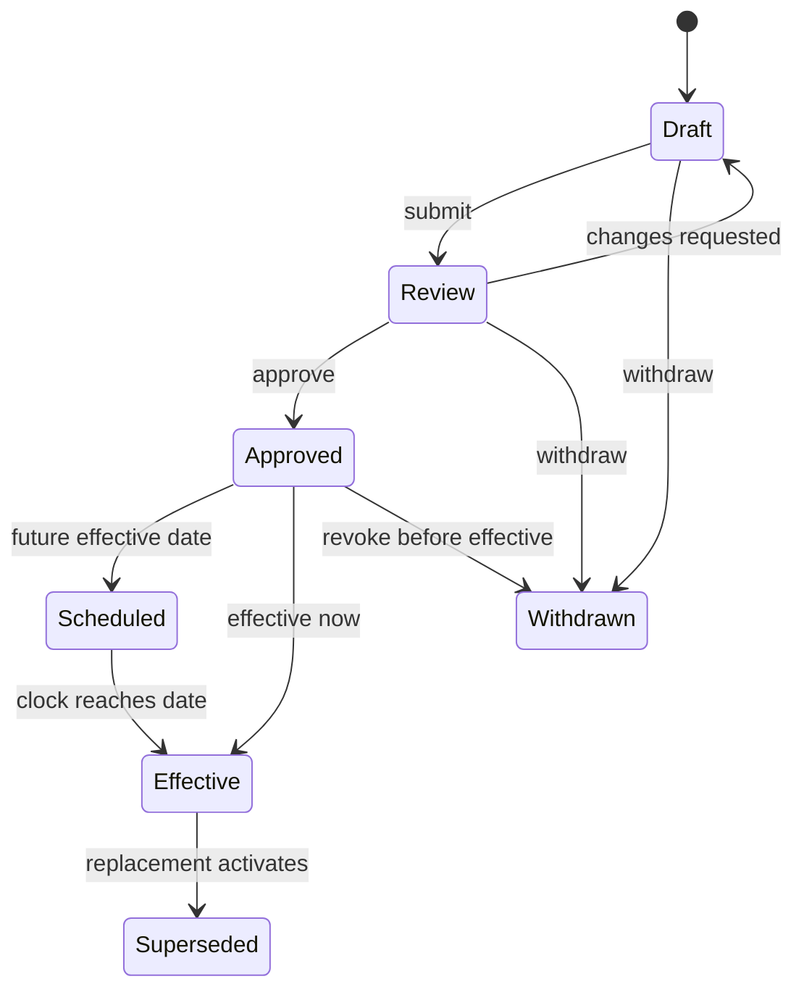

# RuleRail Detailed Design and Functional Requirements

**Document version:** 1.0  
**Status:** Detailed baseline for implementation and acceptance  
**Baseline date:** 3 September 2026  
**Related documents:** [BRD](./BRD.md), [HLD](./HLD.md)

## 1. Purpose and conventions

This document describes detailed behavior for the target RuleRail platform and identifies the subset implemented by the public MVP. It is a combined low-level design (LLD), functional-requirements specification and acceptance baseline.

Requirements use these priorities:

- **Must:** required for the first enterprise pilot.
- **Should:** planned after the pilot baseline or negotiable per pilot.
- **Could:** future extension.

`MVP` in the coverage tables means the behavior is represented in the public browser demo using synthetic data. `Target` means the behavior belongs to the production platform design.

## 2. Roles and permissions

| Role | Core permissions |
|---|---|
| Platform Admin | Manage tenants, platform reference data and support access; no default access to tenant payloads |
| Tenant Admin | Manage tenant brand, memberships, corporate entitlements and configuration |
| Standards Author | Register sources; draft rules, mappings and profiles |
| Standards Approver | Review, approve, reject and supersede governed content |
| Product Owner | Own change impact, product scope and release readiness |
| Client Manager | Manage client segmentation, communications, tasks and progress |
| Corporate Admin | Manage corporate users and assigned programmes within entitlement |
| Corporate User | View guidance, compare profiles, validate test files and submit evidence |
| Auditor | Read approved content, history, evidence and exports without mutation |
| API Client | Invoke explicitly granted machine scopes |

### 2.1 Permission rules

- **FR-SEC-001 (Must):** Every target-platform request shall resolve an authenticated subject, tenant and permission set.
- **FR-SEC-002 (Must):** A user shall not query or mutate an entity outside their tenant or corporate entitlement.
- **FR-SEC-003 (Must):** Rule/profile approval shall require a different authorized user from the most recent author when separation of duties is enabled.
- **FR-SEC-004 (Must):** Auditor access shall be read-only.
- **FR-SEC-005 (Must):** Machine clients shall use scopes narrower than interactive administrator roles.
- **FR-SEC-006 (Should):** Support staff access shall be time-limited, approved and explicitly audited.

## 3. Functional module specification

### 3.1 Dashboard and work queue

#### Behavior

- **FR-DASH-001 (Must/MVP):** Show current regulatory alerts with status, date, authority, affected schemes and source link.
- **FR-DASH-002 (Must/MVP):** Show client-readiness counts grouped by state.
- **FR-DASH-003 (Must/MVP):** Show key counts for active rules, impacted clients, test pass rate and open high-severity findings.
- **FR-DASH-004 (Must):** Filter all dashboard metrics by tenant, programme, product, segment and accountable owner.
- **FR-DASH-005 (Must):** Show work items due, overdue and blocked for the signed-in user.
- **FR-DASH-006 (Should):** Allow a user to subscribe to a saved dashboard filter.

#### Acceptance

Given the public demo dataset, the dashboard shall label the EPC 15 November 2026 date as active pending review and the Swift payments change as deferred, rather than combining them into one deadline.

### 3.2 Source registry

#### Behavior

- **FR-SRC-001 (Must/MVP-read):** List sources by authority, type, lifecycle state, publication date and effective date.
- **FR-SRC-002 (Must):** Register a source with title, authority, canonical URL, jurisdiction, document type, owner and classification.
- **FR-SRC-003 (Must):** Add immutable source versions with received timestamp, document hash and storage reference.
- **FR-SRC-004 (Must):** Mark a source version as draft, under review, approved, deferred, effective, expired or superseded.
- **FR-SRC-005 (Must):** Link a source reference to page/section/paragraph coordinates where licensing permits.
- **FR-SRC-006 (Must):** Prevent deletion of a source version cited by an approved rule; support withdrawal with reason.
- **FR-SRC-007 (Should):** Poll configured source locations and create a candidate change when content metadata or hash changes.
- **FR-SRC-008 (Should):** Allow assisted extraction to propose references and candidate requirements, visibly marked unapproved.

#### Validation

- Canonical URL must be HTTPS except for approved internal repositories.
- Version hash must be unique within a source.
- Effective end, when present, must follow effective start.
- An approved version requires an owner and at least one resolvable source reference.

### 3.3 Rule workbench

#### Behavior

- **FR-RUL-001 (Must/MVP-read):** Search rules by authority, scheme, message, field, state, effective date and text.
- **FR-RUL-002 (Must):** Create a rule family with a stable business identifier.
- **FR-RUL-003 (Must):** Create immutable rule versions with effective interval and semantic version.
- **FR-RUL-004 (Must):** Define applicability conditions using approved attributes and operators.
- **FR-RUL-005 (Must):** Define one or more assertions, severity, user guidance and machine path.
- **FR-RUL-006 (Must):** Cite at least one approved source reference before submission for approval.
- **FR-RUL-007 (Must):** Preview matching and non-matching scenarios before approval.
- **FR-RUL-008 (Must):** Detect overlap, contradiction and gaps against active rules in the same family.
- **FR-RUL-009 (Must):** Compare two versions with additions, removals and modified conditions/assertions.
- **FR-RUL-010 (Must):** Submit, approve, reject, schedule, withdraw and supersede a version.
- **FR-RUL-011 (Must):** Record reason and reviewer for every state transition.
- **FR-RUL-012 (Should):** Import/export governed rule packs using a signed manifest.

#### Rule-version lifecycle



### 3.4 Applicability engine

- **FR-APP-001 (Must/MVP):** Accept scheme, message type, bank profile, channel and execution date as scenario context.
- **FR-APP-002 (Must):** Accept optional geography, service level, local instrument, party role and client exception.
- **FR-APP-003 (Must):** Select only approved rules effective for the supplied date.
- **FR-APP-004 (Must):** Apply precedence in the order scheme baseline, infrastructure, bank, channel and approved client exception.
- **FR-APP-005 (Must):** Reject unresolved conflicts instead of silently choosing a rule.
- **FR-APP-006 (Must/MVP):** Return a human explanation for included rules.
- **FR-APP-007 (Must):** Return excluded candidates and exclusion reasons when diagnostic mode is authorized.
- **FR-APP-008 (Must):** Return a content hash and identifiers for every selected version.
- **FR-APP-009 (Must):** Require explicit handling of missing context; do not assume a less restrictive profile.

#### Resolution pseudocode

```text
validate(context)
candidates = approved rules matching authority/message and effective interval
matches = candidates where evaluate(rule.condition, context) is true
group matches by rule family and target path
order each group by approved overlay precedence and specificity
detect incompatible assertions; return conflict if unresolved
return composed rules, explanations, version IDs and content hash
```

### 3.5 Bank profile studio and multibank comparison

- **FR-PRO-001 (Must/MVP-read):** Display a matrix of selected bank profiles by field/requirement.
- **FR-PRO-002 (Must):** Create a profile against one defined scheme/network baseline.
- **FR-PRO-003 (Must):** Add channel-specific overlays and supported message versions.
- **FR-PRO-004 (Must):** Classify each field as required, conditional, optional, not permitted or inherited.
- **FR-PRO-005 (Must):** Identify a stricter overlay and cite its bank-owned source.
- **FR-PRO-006 (Must):** Version and approve a profile before client/API publication.
- **FR-PRO-007 (Must):** Compare two or more profiles for one scenario and effective date.
- **FR-PRO-008 (Must/MVP):** Highlight differences rather than only displaying full profiles.
- **FR-PRO-009 (Should):** Export comparison as CSV, PDF and a machine-readable profile.

### 3.6 Validation Lab and API

- **FR-VAL-001 (Must/MVP):** Accept supported sample XML pasted by a user.
- **FR-VAL-002 (Must):** Accept direct API payload, asynchronous file upload and previously stored test artifact.
- **FR-VAL-003 (Must/MVP):** Detect malformed XML and return a blocking parse finding.
- **FR-VAL-004 (Must):** Resolve the message definition and selected profile before semantic evaluation.
- **FR-VAL-005 (Must/MVP):** Check illustrative postal-address rules for `pain.001`, `pain.008` and `pacs.008` inputs.
- **FR-VAL-006 (Must):** Validate secure schema, scheme, profile and approved-exception layers.
- **FR-VAL-007 (Must/MVP):** Return severity, field/path, message, corrective action and cited rule/source.
- **FR-VAL-008 (Must):** Pin every result to a rule-set hash and effective date.
- **FR-VAL-009 (Must):** Provide summary counts and pass/fail outcome.
- **FR-VAL-010 (Must):** Redact configured payment-data fields from logs and support results.
- **FR-VAL-011 (Must):** Allow a result to be attached to a client test cycle as evidence.
- **FR-VAL-012 (Should):** Support downloadable JSON and human-readable reports.
- **FR-VAL-013 (Must):** Never submit, authorize or route the supplied payment.

#### Finding structure

| Field | Meaning |
|---|---|
| `code` | Stable RuleRail finding code |
| `severity` | `error`, `warning` or `info` |
| `path` | XML/JSON field locator |
| `observed` | Redacted or safe summary of actual state |
| `message` | Concise user explanation |
| `correction` | Action needed to resolve the finding |
| `ruleVersionId` | Governing normalized rule version |
| `sourceReferenceId` | Source citation |
| `profileVersionId` | Applied bank/channel profile |

### 3.7 Change impact

- **FR-IMP-001 (Must/MVP):** Present a changed requirement with old/new state and regulatory status.
- **FR-IMP-002 (Must):** Generate candidate impacts from rule-to-asset mappings.
- **FR-IMP-003 (Must/MVP):** Group impacted items by clients, messages, systems, channels and tests.
- **FR-IMP-004 (Must):** Assign owner, impact rating, decision, due date and rationale to each item.
- **FR-IMP-005 (Must):** Support `impacted`, `not impacted`, `unknown` and `accepted risk` decisions.
- **FR-IMP-006 (Must):** Preserve assessment history and require reason for override.
- **FR-IMP-007 (Should):** Reopen completed assessments when a governing rule changes again.

### 3.8 Corporate client portfolio

- **FR-CLI-001 (Must/MVP):** List synthetic/entitled corporate clients with segment, owner, channels, formats, impacted state and readiness.
- **FR-CLI-002 (Must):** Import client-scope attributes from approved CRM/payment-channel sources.
- **FR-CLI-003 (Must):** Segment clients using saved, versioned criteria.
- **FR-CLI-004 (Must):** Explain why a client is in or out of scope.
- **FR-CLI-005 (Must/MVP):** Filter by readiness state and search by client name.
- **FR-CLI-006 (Must/MVP):** Update a demo client readiness state and preserve it locally.
- **FR-CLI-007 (Must):** Require role permission and transition rules for production state changes.
- **FR-CLI-008 (Must):** Record owner, due date, blocker and latest evidence for every impacted client.

### 3.9 White-label readiness portal

- **FR-PRT-001 (Must/MVP):** Apply bank/tenant name, logo, colors, support contact and legal notice.
- **FR-PRT-002 (Must):** Show only programmes and profiles entitled to the corporate organization.
- **FR-PRT-003 (Must):** Present personalized impact summary and required actions.
- **FR-PRT-004 (Must):** Support acknowledgement of change notices.
- **FR-PRT-005 (Must):** Provide implementation guidance, examples and controlled downloads.
- **FR-PRT-006 (Must):** Allow test submission and show explainable validation findings.
- **FR-PRT-007 (Must):** Allow evidence submission subject to type, size and malware controls.
- **FR-PRT-008 (Must):** Show progress, due dates, blockers, exceptions and support contact.
- **FR-PRT-009 (Should):** Support localized content per programme.

### 3.10 Tasks, testing, exceptions and certification

- **FR-WFL-001 (Must/MVP-read):** Display a migration checklist with owner, state and due date.
- **FR-WFL-002 (Must):** Instantiate a journey template for every in-scope client.
- **FR-WFL-003 (Must):** Enforce task dependencies and completion evidence rules.
- **FR-WFL-004 (Must):** Create test cycles with profile version, scenarios, result and reviewer.
- **FR-WFL-005 (Must):** Prevent readiness/certification while blocking tasks or failed mandatory tests remain.
- **FR-WFL-006 (Must):** Allow authorized exception requests with scope, reason, compensating control and expiry.
- **FR-WFL-007 (Must):** Require a different authorized approver for material exceptions.
- **FR-WFL-008 (Must):** Issue a versioned certification containing client, programme, profiles, effective date and evidence set.
- **FR-WFL-009 (Must):** Reopen readiness when its governing profile changes materially.

### 3.11 Notifications

- **FR-NOT-001 (Must):** Send notification only after checking tenant, client and programme entitlement.
- **FR-NOT-002 (Must):** Use approved, versioned templates with locale and brand.
- **FR-NOT-003 (Must):** Support immediate, scheduled and digest delivery.
- **FR-NOT-004 (Must):** Track requested, delivered, bounced and acknowledged states.
- **FR-NOT-005 (Must):** Retry transient failure with bounded exponential backoff.
- **FR-NOT-006 (Should):** Support email, webhook and collaboration-tool channels.

### 3.12 Evidence, audit and reporting

- **FR-EVD-001 (Must):** Store evidence metadata, hash, classification, uploader, retention and linked entity.
- **FR-EVD-002 (Must):** Verify authorization on every evidence access and download.
- **FR-EVD-003 (Must):** Append audit events for governed content, impact, workflow, exceptions and certifications.
- **FR-EVD-004 (Must):** Audit before/after values for allowed non-sensitive fields.
- **FR-EVD-005 (Must):** Export a readiness evidence pack with its generation parameters and hash.
- **FR-EVD-006 (Must):** Report readiness funnel, overdue clients, finding trends and change-decision aging.
- **FR-EVD-007 (Should):** Provide scheduled reports and BI extracts.

## 4. Public MVP screen specification

| View | Primary content | Key interactions |
|---|---|---|
| Command Center | Deadline watch, KPIs, readiness distribution, priority actions | Open source, navigate to impacted workflow |
| Standards Hub | Searchable/filterable rule catalogue and source cards | Filter authority/state, open detail/source |
| Bank Comparison | Scenario selectors and three-bank requirement matrix | Toggle banks, show differences |
| Validation Lab | Sample selector, XML editor, findings panel | Load example, validate, inspect source-linked finding |
| Client Readiness | Client table, filters, programme progress | Search/filter, change synthetic readiness state |
| Change Impact | Current change, affected assets and actions | Choose EPC/Swift change, inspect impact |
| Certification | Migration checklist and evidence summary | Review status and blocked items |

### 4.1 MVP navigation and state

- Navigation is client-side using view identifiers; one view is visible at a time.
- The current view is reflected in the URL hash and can be opened directly.
- Synthetic client-state updates are saved under one namespaced `localStorage` key.
- `Reset demo` removes only RuleRail demo keys and reloads the default data.
- The application must remain usable if local storage is unavailable.
- The active navigation item and page heading update together.

### 4.2 Responsive behavior

- At widths below 900 px, the sidebar becomes a dismissible overlay opened from the top bar.
- Data matrices remain horizontally scrollable inside their own containers; the page itself shall not overflow horizontally.
- Interactive targets have a minimum effective size of 40 by 40 CSS pixels.
- The main dashboard and content cards collapse to one column on narrow screens.

### 4.3 Accessibility

- One `h1` per view; heading order remains logical.
- All controls have visible labels and keyboard focus indicators.
- Navigation uses buttons or anchors with current-state semantics.
- Status is conveyed by text plus color, not color alone.
- Dialog/side navigation focus is contained while open and returns to the opener on close.
- Validation summary uses an `aria-live` region without moving focus unexpectedly.
- Motion honors `prefers-reduced-motion`.

## 5. Data model

### 5.1 Governed entities

| Entity | Required fields | Key constraints |
|---|---|---|
| `Tenant` | `id`, `name`, `status`, `defaultLocale` | Unique active name/slug |
| `Source` | `id`, `authorityId`, `title`, `canonicalUrl`, `ownerId`, `classification` | Tenant/global scope explicit |
| `SourceVersion` | `id`, `sourceId`, `versionLabel`, `publishedAt`, `receivedAt`, `contentHash`, `state` | Hash immutable |
| `SourceReference` | `id`, `sourceVersionId`, `locator`, `excerptSummary` | Approved rules require ≥1 |
| `RuleFamily` | `id`, `businessCode`, `targetPath`, `title` | Stable business code |
| `RuleVersion` | `id`, `familyId`, `semanticVersion`, `state`, `effectiveFrom`, `effectiveTo`, `condition`, `assertions` | No mutation after approval |
| `ProfileVersion` | `id`, `profileId`, `baselineId`, `version`, `state`, `effectiveFrom`, `contentHash` | Published versions immutable |
| `Approval` | `id`, `entityType`, `entityId`, `decision`, `actorId`, `decidedAt`, `reason` | Append-only |

### 5.2 Operational entities

| Entity | Required fields | Key constraints |
|---|---|---|
| `ValidationJob` | `id`, `tenantId`, `status`, `scenario`, `ruleSetHash`, `createdAt` | Idempotency key optional/unique per client |
| `Finding` | `id`, `jobId`, `code`, `severity`, `path`, `ruleVersionId`, `message` | Ordered deterministically |
| `CorporateClient` | `id`, `tenantId`, `externalRef`, `name`, `segment`, `ownerId` | External ref unique per tenant |
| `Programme` | `id`, `tenantId`, `ruleChangeId`, `title`, `targetDate`, `state` | One or more journey templates |
| `ClientJourney` | `id`, `programmeId`, `clientId`, `readinessState`, `ownerId`, `dueAt` | Unique client/programme |
| `Task` | `id`, `journeyId`, `type`, `state`, `dueAt`, `assigneeId` | Dependencies acyclic |
| `TestCycle` | `id`, `journeyId`, `profileVersionId`, `state`, `result` | Profile pinned |
| `Exception` | `id`, `journeyId`, `scope`, `reason`, `state`, `expiresAt` | Approval and expiry required |
| `Certification` | `id`, `journeyId`, `version`, `issuedAt`, `issuedBy`, `evidenceHash` | Immutable and supersedable |
| `AuditEvent` | `id`, `tenantId`, `occurredAt`, `actorId`, `action`, `entityRef`, `correlationId` | Append-only |

### 5.3 Illustrative rule representation

```json
{
  "businessCode": "ADDR.POSTAL.HYBRID.MINIMUM",
  "version": "1.2.0",
  "state": "approved",
  "effectiveFrom": "2026-11-15",
  "scope": {
    "authority": "EPC",
    "schemes": ["SCT", "SCT_INST", "SDD_CORE", "SDD_B2B", "OCT_INST"],
    "messageTypes": ["pain.001", "pain.008", "pacs.008"]
  },
  "condition": {
    "all": [
      { "field": "executionDate", "operator": "gte", "value": "2026-11-15" },
      { "field": "postalAddress.addressLineCount", "operator": "gt", "value": 0 }
    ]
  },
  "assertions": [
    { "path": "*/PstlAdr/TwnNm", "operator": "present", "severity": "error" },
    { "path": "*/PstlAdr/Ctry", "operator": "present", "severity": "error" }
  ],
  "sourceReferenceIds": ["src-ref-epc-address-guidance"],
  "guidance": "When address lines are retained, also provide town name and country."
}
```

This representation is illustrative. The production condition DSL shall use a validated AST, allow-listed operators, explicit types and bounded evaluation complexity; it shall not evaluate arbitrary code.

## 6. API contracts

### 6.1 Resolve applicability

`POST /api/v1/applicability:resolve`

Request:

```json
{
  "profileId": "bp_meridian_api",
  "scheme": "SCT_INST",
  "messageType": "pain.001.001.09",
  "channel": "API",
  "executionDate": "2026-11-20",
  "geography": { "debtor": "DE", "creditor": "FR" }
}
```

Response contains `ruleSetId`, `contentHash`, resolved version references, explanations and conflicts. Missing required context returns `422` with problem details.

### 6.2 Create validation

`POST /api/v1/validations`

- Media types: `application/xml`, `application/json` or multipart metadata plus upload reference.
- Required headers: `Authorization`, `Idempotency-Key` for partner clients and optional `X-Correlation-ID`.
- Synchronous response for permitted small messages; `202 Accepted` with job URL for bulk/asynchronous work.
- The response does not echo the full submitted payment payload.

### 6.3 Transition client journey

`POST /api/v1/programmes/{programmeId}/clients/{clientId}/transitions`

Request supplies target state, reason, evidence references and optimistic concurrency version. Invalid transitions return `409` with unmet prerequisites.

### 6.4 Error envelope

Use RFC 9457 problem details with `type`, `title`, `status`, `detail`, `instance`, `code`, `correlationId` and field-level `errors` where safe.

## 7. Validation and workflow algorithms

### 7.1 Postal-address checks represented in the demo

For each `PstlAdr` element:

1. If neither structured elements nor `AdrLine` exist, return informational guidance only when the selected profile expects a postal address.
2. If `AdrLine` exists and `TwnNm` or `Ctry` is absent, return a blocking hybrid-address finding for the EPC effective-date scenario.
3. If `AdrLine` exists after the selected profile prohibits unstructured lines, return a blocking profile finding.
4. If `TwnNm` and `Ctry` exist, the minimum hybrid check passes; other structured checks may still apply.
5. Report all address occurrences with stable 1-based paths and deterministic ordering.

The demo intentionally does not claim full ISO 20022 XSD or bank-profile conformance.

### 7.2 Certification eligibility

A client journey is eligible for `Ready` when all mandatory tasks are complete, the latest required test cycles pass, no blocking finding is unresolved, and every active exception is approved and unexpired. `Certified` additionally requires an authorized human decision and creation of a versioned evidence manifest.

## 8. Analytics event design

The public MVP uses Vercel page-view analytics and emits only non-sensitive product events when supported.

| Event | Safe properties |
|---|---|
| `view_opened` | view identifier |
| `rule_filter_changed` | authority/state only |
| `comparison_updated` | number of profiles, scenario identifier |
| `sample_loaded` | sample identifier |
| `validation_completed` | result class and finding counts; never XML content |
| `client_filter_changed` | readiness category only |
| `demo_state_updated` | new readiness state; never client name |
| `source_opened` | authority and source identifier |

Analytics shall never receive payment content, account identifiers, postal-address values, personal names or free-text evidence.

## 9. Error handling

- Parsing failures return one clear blocking finding and preserve the editor content in the browser.
- Unsupported message families return `unsupported_message`, not a generic internal error.
- Missing applicability context returns actionable missing-field errors.
- Rule conflicts stop validation for the affected field and direct the user to governance review.
- Background jobs use explicit queued/running/completed/failed/expired states.
- Retryable integration failures are retried; permanent failures go to a visible work queue.
- UI errors are announced accessibly and include a correlation ID for server-side failures.
- The public demo falls back to default synthetic data if stored state is corrupt.

## 10. Security and privacy controls

- XML parsing disables DTD, external entities and network resolution.
- File type is verified from content, not extension alone.
- File size, element depth, node count and processing time are bounded.
- Stored objects are encrypted, malware-scanned and access-controlled.
- Logs use redaction rules and never contain raw submitted messages by default.
- Personal data fields are documented in a data inventory and subject to retention controls.
- Rule/profile exports are signed or checksum-protected.
- State-changing endpoints enforce CSRF protection for cookie-based sessions.
- Content Security Policy, secure cookies, HSTS and anti-clickjacking headers are enabled.
- Dependency and container scanning are release gates.

## 11. Test specification

### 11.1 Public MVP acceptance cases

| ID | Scenario | Expected result |
|---|---|---|
| MVP-001 | Open application at desktop width | Command Center loads; no console-blocking error |
| MVP-002 | Navigate by sidebar and URL hash | Correct view and active item are displayed |
| MVP-003 | Open EPC source | Official EPC page opens in a new tab |
| MVP-004 | Select Swift deferred change | Status is `Deferred`; revised date is not invented |
| MVP-005 | Compare three fictional banks | Differences in address-line allowance and structured fields are visible |
| MVP-006 | Validate hybrid compliant sample | No blocking minimum-hybrid finding |
| MVP-007 | Validate unstructured sample | Missing town/country blocking findings appear |
| MVP-008 | Validate malformed XML | One parse finding appears without page failure |
| MVP-009 | Change synthetic client state, reload | State is preserved in the same browser |
| MVP-010 | Reset demo | Only RuleRail demo state is cleared and defaults return |
| MVP-011 | Use keyboard only | All primary interactions and focus states are usable |
| MVP-012 | Open at 375 px width | No page-level horizontal overflow; sidebar is operable |
| MVP-013 | Inspect page source/network | Vercel Web Analytics script is present |

### 11.2 Target-platform test layers

- Unit tests for condition evaluation, precedence, effective dates and transition rules.
- Property tests for deterministic results and rule ordering.
- Contract tests for every public API and event version.
- Integration tests for database, object storage, identity and notification adapters.
- Golden-file tests for message/profile validation packs.
- Tenant-isolation and authorization tests, including ID enumeration attempts.
- XML parser abuse, oversized file, entity expansion and path traversal tests.
- Accessibility automated scans plus manual keyboard/screen-reader review.
- Performance tests for catalogue, synchronous validation and bulk queues.
- Recovery exercises for database restore and interrupted job resumption.

## 12. Traceability

| Business capability | Detailed requirements |
|---|---|
| Source governance | FR-SRC-* |
| Rule intelligence | FR-RUL-*, FR-APP-* |
| Bank profiles and comparison | FR-PRO-* |
| Validation | FR-VAL-* |
| Change impact | FR-IMP-* |
| Client migration | FR-CLI-*, FR-PRT-*, FR-WFL-* |
| Evidence and audit | FR-EVD-* |
| Notifications | FR-NOT-* |
| Security | FR-SEC-* and section 10 |

## 13. Definition of done for the public MVP

The demo is done when:

1. All seven specified views are implemented with synthetic data and explicit demo labeling.
2. Current EPC/Swift status is accurately separated and linked to official sources.
3. The three validation acceptance paths pass automated tests.
4. Client-state persistence and reset behave as specified.
5. The repository contains BRD, HLD, this detailed specification and run instructions.
6. Static reference, syntax and responsive-layout checks pass.
7. The production Vercel deployment is reachable and Web Analytics instrumentation is present.
8. The Vercel project is connected to the designated GitHub repository.
9. The UI states that RuleRail does not process payments and that demo rules are illustrative.

## 14. Production questions requiring pilot decisions

- Precise licensed source content that RuleRail may store and reproduce.
- First bank/channel profiles and their accountable approvers.
- Mandatory schemas, market practice rules and expected validation volume.
- Corporate identity and delegated administration model.
- Evidence/file retention by country and customer contract.
- Readiness/certification legal meaning and exception authority.
- Availability, recovery and data-residency commitments.
- Integration sources for client segmentation and system-impact inventory.

